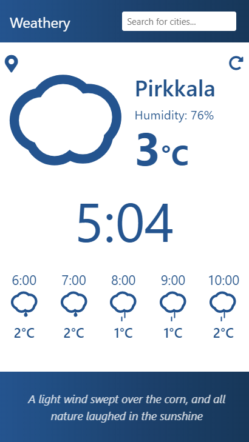

# WEATHERY #

Small weather app where the user can find local weather forecast and also search for forecasts in any Scandinavian city.
[App is hosted with Heroku.](https://weathery-weather-app.herokuapp.com/)

The app is implemented with Vue.js and meant for mobile devices.
Finnish Meteorological Institute's (FMI) API is used for retrieving the forecast data.
Google's reverse geocoding API is used for locating the user.

Other dependencies:
* Express for setting up the deployment server: https://www.npmjs.com/package/express
    * Also serve-static: https://www.npmjs.com/package/serve-static
* Moment.js for calculating and handling times: https://momentjs.com/docs/
* Suncalc for finding out if it's night or not: https://github.com/mourner/suncalc
* Vue-resource for fetching data: https://github.com/pagekit/vue-resource
* Vue-skycons for the weather icons: https://www.npmjs.com/package/vue-skycons
* xml2js for parsing the FMI's XML response: https://www.npmjs.com/package/xml2js

Ideas for improvement:
* Improved responsiveness
    * Deployed version's UI might break on some devices (horizontal scrolling).
    * The search bar is suspected to cause this.
* Unknown bug with weather quotes 
    * When changing forecast data, quotes don't alway reload/show properly.
* Auto-suggestion for the search bar.

This project was bootstrapped with [Create React App](https://github.com/facebookincubator/create-react-app).